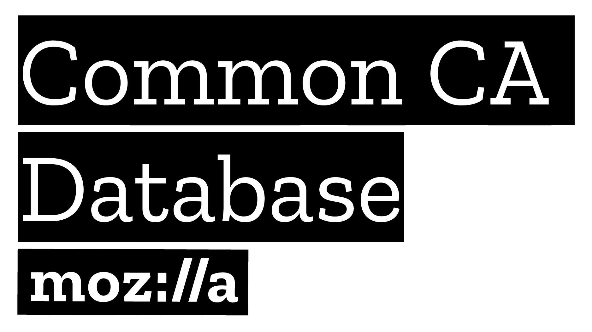

{:width="200px" style="float: right" }

The Common CA Database (CCADB) is a repository of information about Certification Authorities (CAs) whose root and
intermediate certificates are included within the products and services of several Root Store Operators. These Root Store Operators use the CCADB to help manage the CAs in their root stores, and they participate in the CCADB to improve security, transparency, and interoperability within this important part of the ecosystem.

